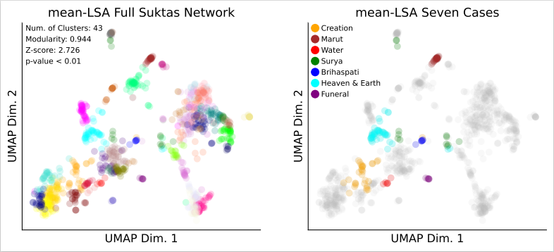
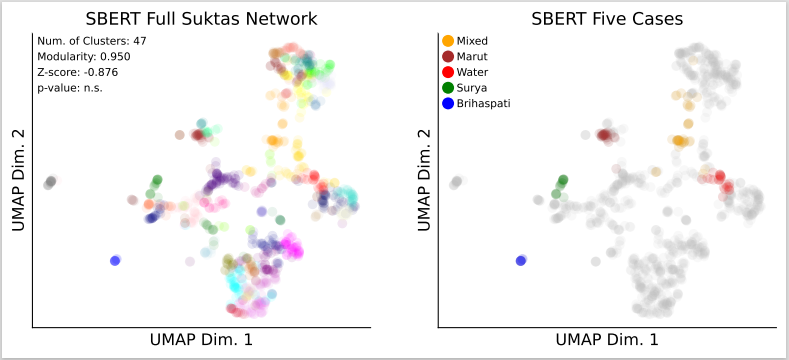
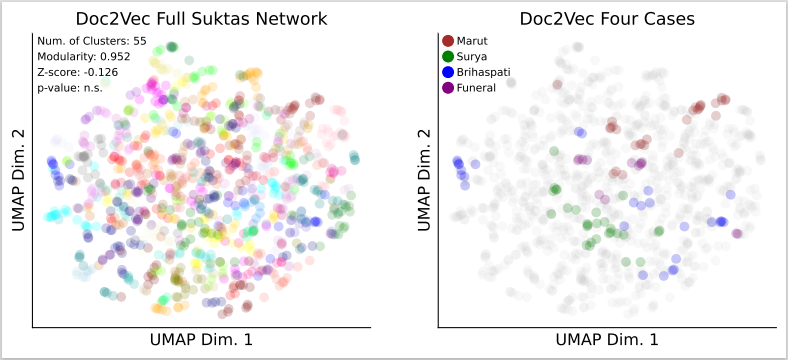

Welcome to my profile page
 

Education
 - Master's in Computer Science

Work experience

<ul>
  <li>ML Researcher, Southern Illinois University Edwardsville - Jan 2025 to present</li>
  <li>ML Research Assistant, Southern Illinois University Edwardsville - Jun 2024 to Dec 2024</li>
  <li>Machine Learning Engineer, Saipem - April 2021 to Jun 2023</li>
</ul>

Publications

  Mapping Hymns and Organizing Concepts in the Rigveda: Quantitatively Connecting the Vedic Suktas

  Proceedings of the 5th International Conference on Natural Language Processing for Digital Humanities at NAACL 2025

"Accessing and gaining insight into the Rigveda poses a non-trivial challenge due to its extremely ancient Sanskrit language, poetic structure, and large volume of text. By using NLP techniques, this study identified topics and semantic connections of hymns within the Rigveda that were corroborated by seven well known groupings of hymns. The 1,028 suktas (hymns) from the modern English translation of the Rigveda by Jamison and Brereton were pre-processed and sukta-level embeddings were obtained using, i) a novel adaptation of LSA, presented herein, ii) SBERT, and iii) Doc2Vec embeddings. Following an UMAP dimension reduction of the vectors, the network of suktas was formed using k-nearest neighbours. Then, community detection of topics in the sukta networks was performed with the Louvain, Leiden, and label propagation methods, whose statistical significance of the formed topics were determined using an appropriate null distribution. Only the novel adaptation of LSA using the Leiden method, had detected sukta topic networks that were significant (z = 2.726, p < .01) with a modularity score of 0.944. Of the seven famous sukta groupings analysed (e.g., creation, funeral, water, etc.) the LSA derived network was successful in all seven cases, while Doc2Vec was not significant and failed to detect the relevant suktas. SBERT detected four of the famous suktas as separate groups but mistakenly combined three of them into a single mixed group. Also, the SBERT network was not statistically significant."

<a href="https://aclanthology.org/2025.nlp4dh-1.44/" target="_blank">Read the full research paper here</a>

Projects

  Genome Sequence Detection Utilizing the PyTorch Framework

<a href="https://github.com/venkateshbollineni/Genome-Sequence-Detection-pytorchframework-DeepLearning" target="_blank">Click for the github repository</a>

Neural Network Model Comparison on Genome Sequence Detection data: AlexNet vs. NiNNet(Network in Network)

Overview

This project compares the performance of two deep learning architectures, AlexNet and NiNNet, using different optimization techniques. The models are trained and evaluated on a given genome sequence dataset to analyze their accuracy and classification performance. The results are visualized using accuracy curves and confusion matrices.

Project Features

✔️ Implementation of AlexNet and NiNNet architectures.

✔️ Training with multiple optimizers: SGD, Adam, and RMSprop.

✔️ Comparison of model performance across different configurations.

✔️ Visualization of accuracy trends over epochs.

✔️ Generation of confusion matrices for error analysis.

Experiment Configurations The project runs experiments with the following configurations:

Model, Optimizer, Batch Size, Learning Rate, Epochs respectively are

AlexNet, SGD, 256, 0.001, 10

AlexNet, Adam, 1032, 0.0001, 10

NiNNet, RMSprop, 516, 0.0005, 10

NiNNet, Adam, 1032, 0.0001, 10

Results & Analysis

📈 Accuracy Curves: The accuracy of each configuration is plotted across epochs to visualize model performance.

📊 Confusion Matrices: Heatmaps are generated to analyse model predictions and misclassifications.

  Predicting Customer Interest in Enhanced Travel Insurance with COVID Cover

<a href="https://github.com/venkateshbollineni/Predicting-Customer-Interest-in-Enhanced-Travel-Insurance-with-COVID-Cover/tree/main" target="_blank">Click for the github repository</a>

🛫📊 Customer Interest Prediction in Travel Insurance: Developed a predictive model using Gradient Boosting to identify potential buyers for a new travel insurance package, including COVID coverage. 

Key Steps & Techniques:

✔️ Data Cleaning & Exploration: Addressed missing values, removed irrelevant features, and performed ANOVA tests to identify key predictors.

⚖️📉 Class Imbalance Handling: Adjusted thresholding techniques to address dataset imbalance (63% opted out, 37% opted in), ensuring better model performance.

🎯📊 Feature Selection: Identified "Age," "Annual Income," and "Ever Travelled Abroad" as the most significant features contributing to the model’s predictive power. 

Model Training & Evaluation:

📊🔍 Model Comparison: Evaluated five machine learning models—Random Forest, Gradient Boosting, Support Vector Machines, Logistic Regression, and Linear Discriminant Analysis. 

🏆📈 Best Model - Gradient Boosting: Achieved 83.1% accuracy, 16.9% test error rate, and 90.8% recall, outperforming other models. 

🔄⚙️ Cross-Validation & Regularization: Tuned hyperparameters (shrinkage, interaction depth) to enhance performance. 

🔮📊 Predictive Insights: The model was applied to 100 unseen data points, correctly identifying 81 as "No" and 19 as "Yes" for purchasing travel insurance. 

Business Impact:

🎯📢 Actionable Insights: Helped optimize marketing strategies by identifying key factors influencing customer interest. 

⚠️🔍 Deployment Considerations: Emphasized balancing false positives (unnecessary purchases) and false negatives (missed customers) before model deployment. 

🚀📈 This project showcased the power of predictive modelling in driving business decisions, refining customer targeting, and enhancing travel insurance adoption strategies. 

<ul>
  <li>

    Tracking the Spread of Invasive Spotted Lanternfly using Machine Learning
  
</li>
  
  <a href="https://github.com/venkateshbollineni/Tracking-the-Spread-of-the-Invasive-Spotted-Lanternfly/tree/main" target="_blank">Click for the github repository</a>
  
  To tackle the spread of the invasive spotted lanternfly (Lycorma delicatula), developed a multiclass classification model to predict infestation density (lyde_density) across various regions. The dataset included geographical, environmental, and survey-based features, with a custom-engineered feature (avg_temp) derived using latitude, longitude, and year-wise temperature trends.
  
  🔹 Key Steps & Techniques:
  
  ✔️ Data Preprocessing & Feature Engineering: Addressed missing values, null values, and categorical encoding.
  
  ✔️ Dimensionality Reduction & Clustering: Applied PCA and K-Means to analyze patterns in lyde_density distribution.
  
  ✔️ Feature Selection: Applied ANOVA F-statistic to identify top contributing features.

  ✔️ Class Imbalance Handling: Implemented SMOTE & Equal Proportions Oversampling to balance the dataset.
  
  🤖 Model Training & Evaluation:
  
  ✔️ Best Model: Gradient Boosting with Oversampling achieved 87.11% accuracy (Trained on ≤ 2020 data, tested on 2021).
  ✔️ Other models evaluated:
  
  🏆 Ensemble methods (Random Forest + XGBoost)
  
  🌲 Random Forest with SMOTE
  
  ⚠️ Gradient Boosting (without the most critical feature 'lyde_established') → 62.22% accuracy drop
  
  📊 Model Validation & Interpretation:

  📉 K-Fold Cross-Validation: Managed bias-variance tradeoff effectively.
  
  📈 Feature Importance Analysis: Identified key drivers of infestation spread using SHAP values.
  
  📊 Confusion Matrices & Classification Reports: Analyzed error distribution across classes.
  
  This project showcases the power of machine learning in environmental conservation and pest control 🦟. By leveraging geospatial data and predictive modelling, it supports informed decision-making for authorities tackling invasive species.
</ul>

<ul>
  <li>
    

      Tracking the Spread of Invasive Spotted Lanternfly using Machine Learning
    

    <ul>
      <li>
        To tackle the spread of the invasive spotted lanternfly (Lycorma delicatula), developed a multiclass classification model to predict infestation density (lyde_density) across various regions. The dataset included geographical, environmental, and survey-based features, with a custom-engineered feature (avg_temp) derived using latitude, longitude, and year-wise temperature trends.
      </li>
    </ul>

    🔹 Key Steps & Techniques:
    <ul>
      <li>✔️ Data Preprocessing & Feature Engineering: Handled missing/null values and categorical encoding.</li>
      <li>✔️ Dimensionality Reduction & Clustering: Applied PCA and K-Means.</li>
      <li>✔️ Feature Selection: Used ANOVA F-statistic.</li>
      <li>✔️ Class Imbalance Handling: SMOTE + Equal Proportions Oversampling.</li>
    </ul>

    🤖 Model Training & Evaluation:
    <ul>
      <li>✔️ Best Model: Gradient Boosting (87.11% accuracy on 2021 test set)</li>
      <li>✔️ Ensemble methods: Random Forest + XGBoost</li>
      <li>✔️ Random Forest with SMOTE</li>
      <li>✔️ Gradient Boosting without key feature <code>'lyde_established'</code> → accuracy dropped to 62.22%</li>
    </ul>

    📊 Model Validation & Interpretation:
    <ul>
      <li>📉 K-Fold Cross-Validation</li>
      <li>📈 SHAP-based Feature Importance</li>
      <li>📊 Confusion Matrices & Classification Reports</li>
    </ul>

    
This project highlights the use of machine learning in environmental conservation and pest control 🦟, enabling data-driven decision-making for managing invasive species.

  </li>
</ul>

Certifications

<a href="https://www.credly.com/badges/b8a529c9-a434-4609-8c08-68825e922bb8/public_url" target="_blank">AWS Certified Machine Learning Engineer – Associate</a>

